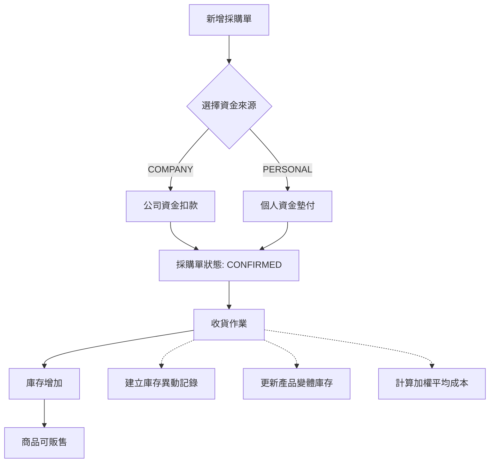
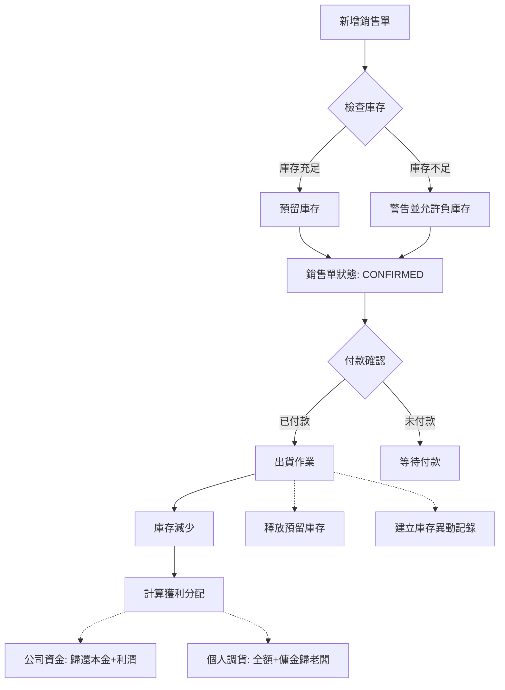
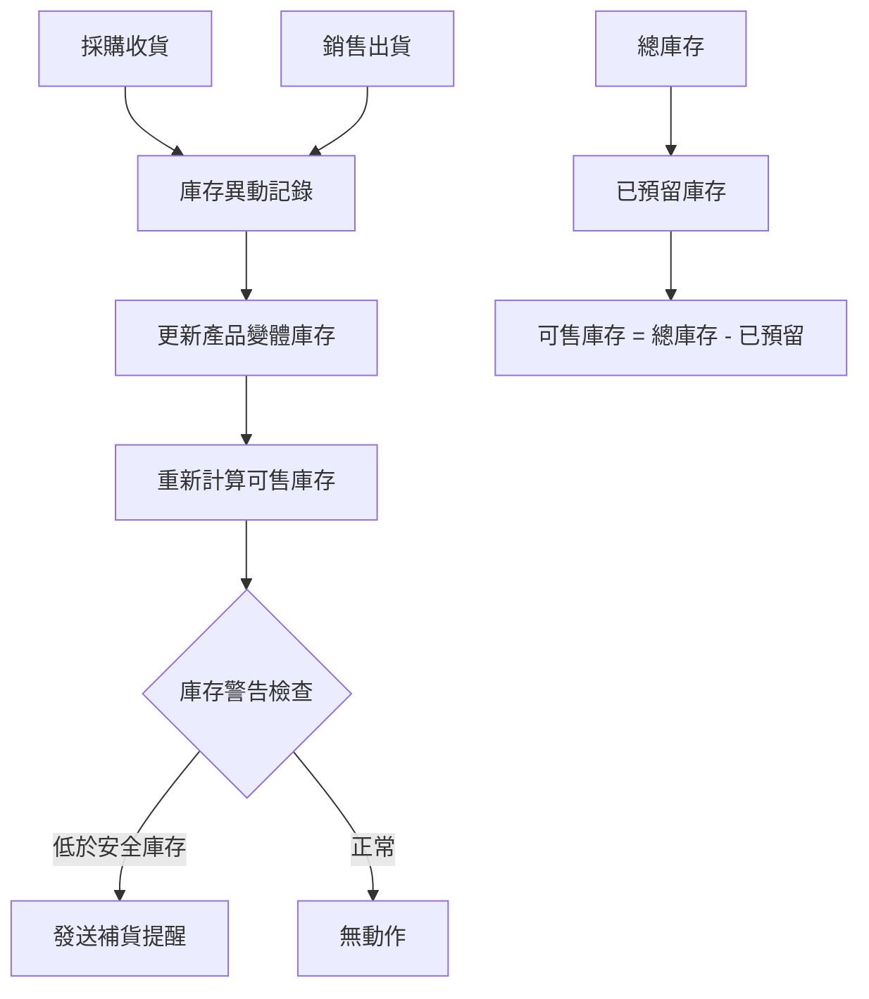

# 🏗️ 酒類交易系統業務邏輯聖經

**版本**: 1.0
**建立日期**: 2025/09/22
**用途**: 防止代代傳承遺失，提供完整業務邏輯參考

---

## 📋 **核心業務理念**

### **資金來源分類**
- **COMPANY**: 公司資金（投資方出錢）
- **PERSONAL**: 個人調貨（老闆私人資金）

### **價格機制（雙重價格系統）**
- **顯示價格 (display_price)**: 投資方看到的價格
- **實際價格 (actual_price)**: 真實收取價格
- **價差傭金**: actual_price - display_price = 老闆私人收益

### **資金流追蹤原則**
```
公司資金投入 → 采購商品 → 銷售獲利 → 扣除成本 → 歸還投資方本金+利潤分享
個人調貨投入 → 采購商品 → 銷售獲利 → 全部歸老闆個人 + 價差傭金
```

---

## 🔗 **完整業務流程 HOOK 關係圖**

### **1. 採購流程 (Purchase Flow)**



**關鍵HOOK點**:
- **刪除檢查**: 檢查是否有收貨記錄，有則禁止直接刪除
- **撤銷收貨**: 還原庫存數量，刪除庫存異動記錄
- **資金追蹤**: 記錄誰出的錢，金額多少

### **2. 銷售流程 (Sales Flow)**



**關鍵HOOK點**:
- **庫存檢查**: 確認可售庫存是否充足
- **預留機制**: 確認後預留庫存，防止超賣
- **資金分配**: 依據資金來源計算分配比例

### **3. 庫存管理 (Inventory Flow)**



**關鍵公式**:
```typescript
可售庫存 = stock_quantity - reserved_stock
加權平均成本 = (原成本*原數量 + 新成本*新數量) / 總數量
```

---

## 💰 **資金流追蹤機制**

### **采購階段資金記錄**
```typescript
interface PurchaseFunding {
  purchase_id: string
  funding_source: 'COMPANY' | 'PERSONAL'
  investor_id?: string  // 公司資金時記錄投資方
  amount: number       // 投入金額
  currency: string
  exchange_rate: number
  twd_amount: number   // 台幣金額
}
```

### **銷售階段獲利分配**
```typescript
interface SalesProfit {
  sale_id: string
  cost_amount: number      // 商品成本
  display_revenue: number  // 顯示收入（投資方看到）
  actual_revenue: number   // 實際收入
  commission: number       // 價差傣金 = actual - display

  // 分配邏輯
  company_profit: number   // 公司資金獲利
  personal_profit: number  // 個人獲利（含傣金）
}
```

### **資金分配邏輯**
```typescript
// 公司資金商品銷售
if (funding_source === 'COMPANY') {
  company_profit = display_revenue - cost_amount
  personal_commission = actual_revenue - display_revenue

  投資方獲得: cost_amount + company_profit
  老闆獲得: personal_commission
}

// 個人調貨銷售
if (funding_source === 'PERSONAL') {
  personal_profit = actual_revenue - cost_amount

  老闆獲得: personal_profit (全額)
}
```

---

## 🚫 **刪除邏輯與HOOK檢查**

### **採購單刪除HOOK**
```typescript
async function checkPurchaseDeletable(purchaseId: string) {
  // 1. 檢查是否有收貨記錄
  const hasReceived = await checkInventoryMovements(purchaseId)
  if (hasReceived) {
    throw new Error('請先撤銷收貨再刪除')
  }

  // 2. 檢查是否有關聯的銷售記錄
  const hasLinkedSales = await checkLinkedSales(purchaseId)
  if (hasLinkedSales) {
    throw new Error('存在關聯銷售記錄，無法刪除')
  }

  return true
}
```

### **銷售單刪除HOOK**
```typescript
async function checkSaleDeletable(saleId: string) {
  // 1. 檢查是否有出貨記錄
  const hasShipped = await checkShippingRecords(saleId)
  if (hasShipped) {
    throw new Error('請先撤銷出貨再刪除')
  }

  // 2. 檢查付款記錄
  const hasPayment = await checkPaymentRecords(saleId)
  if (hasPayment) {
    throw new Error('存在付款記錄，請先處理')
  }

  // 3. 釋放預留庫存
  await releaseReservedStock(saleId)

  return true
}
```

### **商品刪除HOOK**
```typescript
async function checkProductDeletable(productId: string) {
  // 1. 檢查是否有庫存
  const hasStock = await checkCurrentStock(productId)
  if (hasStock > 0) {
    throw new Error('商品仍有庫存，無法刪除')
  }

  // 2. 檢查歷史交易記錄
  const hasTransactions = await checkTransactionHistory(productId)
  if (hasTransactions) {
    throw new Error('商品有交易歷史，無法刪除')
  }

  return true
}
```

---

## 📊 **狀態機與流程控制**

### **採購單狀態機**
```
DRAFT → CONFIRMED → RECEIVED → COMPLETED
  ↓       ↓          ↓
DELETE  DELETE   UNDO_RECEIVE → DELETE
```

### **銷售單狀態機**
```
DRAFT → CONFIRMED → SHIPPED → DELIVERED
  ↓       ↓          ↓
DELETE  DELETE   UNDO_SHIP → DELETE
```

### **庫存狀態檢查**
```typescript
interface StockValidation {
  available_stock: number    // 可售庫存
  reserved_stock: number     // 預留庫存
  total_stock: number        // 總庫存

  // 安全檢查
  canSell: (quantity: number) => boolean
  canReserve: (quantity: number) => boolean
}
```

---

## 🎯 **價格邏輯統一原則**

### **價格來源優先順序**
1. **客戶專屬價格** (CustomerSpecialPrice)
2. **產品變體當前價格** (ProductVariant.current_price)
3. **產品標準價格** (Product.standard_price)

### **銷售定價邏輯**
```typescript
function calculateSalePrice(customerId: string, productId: string, variantId?: string) {
  // 1. 查詢客戶專屬價格
  const specialPrice = await getCustomerSpecialPrice(customerId, productId)
  if (specialPrice && specialPrice.is_active) {
    return specialPrice.special_price
  }

  // 2. 使用變體價格
  if (variantId) {
    const variant = await getProductVariant(variantId)
    return variant.current_price
  }

  // 3. 使用產品標準價格
  const product = await getProduct(productId)
  return product.current_price
}
```

---

## 🔒 **權限控制與資料隔離**

### **投資方資料隔離**
```typescript
// 投資方只能看到
interface InvestorView {
  display_amount: number     // 顯示金額
  display_revenue: number    // 顯示收入
  company_profit: number     // 公司獲利

  // 隱藏欄位
  // actual_amount: HIDDEN
  // commission: HIDDEN
  // personal_funding: HIDDEN
}
```

### **超級管理員完整視圖**
```typescript
interface SuperAdminView {
  // 所有欄位都可見
  display_amount: number
  actual_amount: number
  commission: number
  funding_source: string
  detailed_profit_breakdown: ProfitBreakdown
}
```

---

## 📝 **實作檢查清單**

### **新增功能時必須檢查**
- [ ] 是否影響庫存計算？
- [ ] 是否影響資金分配？
- [ ] 是否需要權限控制？
- [ ] 是否需要HOOK其他功能？
- [ ] 刪除邏輯是否完整？

### **修改現有功能時必須檢查**
- [ ] 是否破壞現有HOOK關係？
- [ ] 資料遷移是否完整？
- [ ] 權限邊界是否正確？
- [ ] 向後兼容性如何？

---

## 🚨 **已知斷裂點與修復狀態**

### **高優先級斷裂** ⚠️⚠️⚠️
- [ ] **庫存管理假資料問題** - 需要完全重建
- [ ] **自動會計分錄缺失** - 簡化為資金流追蹤
- [ ] **價格來源不統一** - 需要建立統一邏輯

### **中優先級斷裂** ⚠️⚠️
- [x] **銷售確認流程** - 已修復
- [x] **採購刪除流程** - 已增加撤銷收貨
- [ ] **客戶專價邏輯** - 需要整合到定價流程

### **低優先級斷裂** ⚠️
- [ ] **報表統計功能** - 需要重建
- [ ] **批量操作功能** - 未實作
- [ ] **庫存盤點功能** - 未實作

---

**💡 此文檔為「代代傳承」防遺失設計，任何AI接手都應先讀此文檔理解完整業務邏輯**