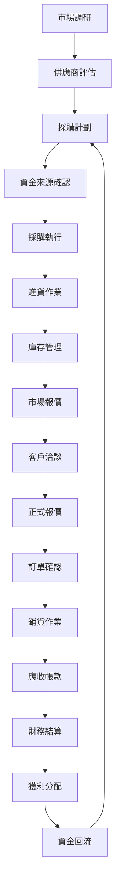

# 📋 酒類交易系統標準作業流程 (SOP)

**版本**: 1.0
**建立日期**: 2025/09/22
**適用範圍**: 完整進銷存業務流程
**更新頻率**: 月檢視，季更新

---

## 🎯 **流程總覽**

### **完整業務閉環**


### **核心業務模組**
1. **採購管理** - 台幣/外幣採購、匯率管理
2. **進貨作業** - 收貨驗收、成本分攤計算
3. **庫存控制** - 實時庫存、預留機制、安全庫存
4. **報價系統** - 臨時報價、正式報價、客戶專價
5. **銷售管理** - 訂單處理、出貨作業
6. **應收管理** - 帳款追蹤、收款確認
7. **財務控制** - 成本核算、獲利分析、資金分配

---

## 💰 **1. 採購管理流程**

### **1.1 採購前準備**

**市場調研階段**:
- [ ] 市場價格調查
- [ ] 供應商比價分析
- [ ] 匯率趨勢評估
- [ ] 資金需求預估

**供應商評估**:
- [ ] 供應商資格審查
- [ ] 信用評級確認
- [ ] 付款條件協商
- [ ] 運輸方式確認

### **1.2 資金來源確認**

**COMPANY 資金流程**:
```typescript
interface CompanyFunding {
  investor_id: string           // 投資方ID
  approved_amount: number       // 核准額度
  currency: 'TWD' | 'USD' | 'JPY' | 'EUR'
  exchange_rate: number         // 當日匯率
  funding_purpose: string       // 投資用途
  expected_return_rate: number  // 預期報酬率
  funding_duration: number      // 資金使用期限(天)
}
```

**PERSONAL 資金流程**:
```typescript
interface PersonalFunding {
  owner_id: string             // 老闆個人ID
  available_balance: number    // 可用餘額
  currency: string
  risk_tolerance: 'HIGH' | 'MEDIUM' | 'LOW'
  expected_margin: number      // 預期毛利率
}
```

### **1.3 採購執行**

**台幣採購 SOP**:
1. **建立採購單**
   - 選擇供應商
   - 輸入商品規格
   - 確認採購數量
   - 設定台幣單價
   - 計算總金額

2. **資金檢查**
   ```typescript
   if (funding_source === 'COMPANY') {
     await checkInvestorApproval(investor_id, total_amount)
     await reserveCompanyFunds(total_amount)
   } else {
     await checkPersonalBalance(owner_id, total_amount)
     await reservePersonalFunds(total_amount)
   }
   ```

3. **採購單確認**
   - 主管審核（超過限額時）
   - 資金預留確認
   - 發送採購單給供應商
   - 狀態更新為 CONFIRMED

**外幣採購 SOP**:
1. **匯率確認**
   - 查詢當日匯率
   - 確認匯差風險
   - 決定匯率鎖定策略

2. **外幣計算**
   ```typescript
   interface ForeignCurrencyPurchase {
     foreign_amount: number      // 外幣金額
     exchange_rate: number       // 採用匯率
     twd_amount: number         // 台幣金額 = foreign_amount * exchange_rate
     currency_risk: number      // 匯差風險評估
     hedge_strategy?: string    // 避險策略
   }
   ```

3. **付款安排**
   - 外匯額度確認
   - 銀行匯款安排
   - 匯款憑證保存

---

## 📦 **2. 進貨作業流程**

### **2.1 收貨驗收**

**到貨通知處理**:
- [ ] 確認採購單號
- [ ] 核對商品規格
- [ ] 檢查包裝完整性
- [ ] 驗收數量清點
- [ ] 品質檢驗確認

**收貨作業 SOP**:
```typescript
async function processReceiving(purchaseId: string, receivingData: ReceivingData) {
  await prisma.$transaction(async (tx) => {
    // 1. 更新採購單狀態
    await tx.purchase.update({
      where: { id: purchaseId },
      data: {
        status: 'RECEIVED',
        received_date: new Date(),
        received_by: receivingData.received_by
      }
    })

    // 2. 建立庫存異動記錄
    for (const item of receivingData.items) {
      await tx.inventoryMovement.create({
        data: {
          product_id: item.product_id,
          variant_id: item.variant_id,
          movement_type: 'PURCHASE',
          reference_type: 'PURCHASE',
          reference_id: purchaseId,
          quantity_before: item.stock_before,
          quantity_change: item.received_quantity,
          quantity_after: item.stock_before + item.received_quantity,
          unit_cost: item.unit_cost,
          total_cost: item.unit_cost * item.received_quantity
        }
      })

      // 3. 更新產品變體庫存
      await tx.productVariant.update({
        where: { id: item.variant_id },
        data: {
          stock_quantity: { increment: item.received_quantity },
          available_stock: { increment: item.received_quantity }
        }
      })
    }

    // 4. 計算加權平均成本
    await calculateWeightedAverageCost(tx, receivingData.items)
  })
}
```

### **2.2 成本分攤計算**

**加權平均成本計算**:
```typescript
interface CostCalculation {
  product_variant_id: string
  previous_stock: number
  previous_cost: number
  new_stock: number
  new_cost: number

  // 計算結果
  total_stock: number        // = previous_stock + new_stock
  weighted_avg_cost: number  // = (previous_stock * previous_cost + new_stock * new_cost) / total_stock
}

async function calculateWeightedAverageCost(tx: PrismaTransaction, items: ReceivingItem[]) {
  for (const item of items) {
    const variant = await tx.productVariant.findUnique({
      where: { id: item.variant_id }
    })

    const previousTotalValue = variant.stock_quantity * variant.weighted_avg_cost
    const newTotalValue = item.received_quantity * item.unit_cost
    const totalQuantity = variant.stock_quantity + item.received_quantity

    const newWeightedAvgCost = totalQuantity > 0
      ? (previousTotalValue + newTotalValue) / totalQuantity
      : item.unit_cost

    await tx.productVariant.update({
      where: { id: item.variant_id },
      data: { weighted_avg_cost: newWeightedAvgCost }
    })
  }
}
```

**進貨成本組成**:
- 商品原價 (FOB/CIF 價格)
- 運輸費用分攤
- 關稅/營業稅
- 匯差損益
- 其他雜費分攤

---

## 📊 **3. 庫存控制流程**

### **3.1 庫存監控**

**即時庫存計算**:
```typescript
interface StockStatus {
  total_stock: number           // 總庫存 = 實際在庫數量
  reserved_stock: number        // 預留庫存 = 已確認未出貨訂單
  available_stock: number       // 可售庫存 = total_stock - reserved_stock
  in_transit_stock: number      // 在途庫存 = 已採購未收貨
  safety_stock: number          // 安全庫存水位
  reorder_point: number         // 再訂購點 = safety_stock + lead_time_demand
}

// 庫存警示機制
async function checkStockAlerts() {
  const lowStockItems = await prisma.productVariant.findMany({
    where: {
      available_stock: {
        lte: prisma.productVariant.fields.safety_stock
      }
    }
  })

  for (const item of lowStockItems) {
    await sendStockAlert({
      product_id: item.product_id,
      variant_id: item.id,
      current_stock: item.available_stock,
      safety_stock: item.safety_stock,
      alert_type: 'LOW_STOCK'
    })
  }
}
```

### **3.2 庫存預留機制**

**預留庫存 SOP**:
```typescript
async function reserveStock(saleId: string, items: SaleItem[]) {
  await prisma.$transaction(async (tx) => {
    for (const item of items) {
      // 檢查可售庫存
      const variant = await tx.productVariant.findUnique({
        where: { id: item.variant_id }
      })

      if (variant.available_stock < item.quantity) {
        throw new Error(`商品 ${variant.name} 庫存不足`)
      }

      // 建立預留記錄
      await tx.stockReservation.create({
        data: {
          sale_id: saleId,
          variant_id: item.variant_id,
          quantity: item.quantity,
          reserved_at: new Date(),
          expires_at: new Date(Date.now() + 7 * 24 * 60 * 60 * 1000) // 7天期限
        }
      })

      // 更新可售庫存
      await tx.productVariant.update({
        where: { id: item.variant_id },
        data: {
          available_stock: { decrement: item.quantity },
          reserved_stock: { increment: item.quantity }
        }
      })
    }
  })
}
```

---

## 💵 **4. 報價系統流程**

### **4.1 價格策略制定**

**價格層級架構**:
```typescript
interface PricingHierarchy {
  customer_special_price?: {    // 最高優先級
    customer_id: string
    product_id: string
    display_price: number       // 投資方看到的價格
    actual_price: number        // 實際收取價格
    commission: number          // 價差傭金 = actual - display
    valid_from: Date
    valid_until: Date
    is_active: boolean
  }

  variant_current_price: {      // 第二優先級
    variant_id: string
    current_price: number
    cost_price: number
    margin_rate: number
  }

  product_standard_price: {     // 最低優先級
    product_id: string
    standard_price: number
    category_margin: number
  }
}
```

### **4.2 臨時報價流程**

**快速報價 SOP**:
1. **客戶詢價接收**
   - [ ] 記錄客戶基本資料
   - [ ] 確認詢價商品規格
   - [ ] 了解數量需求
   - [ ] 評估交期要求

2. **成本計算**
   ```typescript
   function calculateQuotePrice(productId: string, quantity: number, customerId?: string) {
     const cost = getWeightedAverageCost(productId)
     const basePrice = cost * (1 + STANDARD_MARGIN_RATE)

     // 數量折扣
     const volumeDiscount = calculateVolumeDiscount(quantity)

     // 客戶等級調整
     const customerAdjustment = getCustomerPriceAdjustment(customerId)

     return basePrice * (1 - volumeDiscount) * customerAdjustment
   }
   ```

3. **報價單生成**
   - 自動計算建議售價
   - 主管核准必要時
   - 生成報價單PDF
   - 發送給客戶

### **4.3 正式報價流程**

**正式報價 SOP**:
1. **商業條件確認**
   - [ ] 價格條件談判
   - [ ] 付款方式協商
   - [ ] 交貨期確認
   - [ ] 品質保證條款

2. **內部核准流程**
   ```typescript
   interface QuoteApproval {
     quote_id: string
     requested_margin: number
     minimum_margin: number
     approval_required: boolean    // margin < minimum_margin
     approved_by?: string
     approval_notes?: string
   }
   ```

3. **客戶專價建立**
   - 確認特殊價格有效期
   - 設定雙重價格機制
   - 建立客戶專價記錄

---

## 🛒 **5. 銷售管理流程**

### **5.1 訂單處理**

**訂單確認 SOP**:
```typescript
async function confirmSaleOrder(saleData: SaleCreateData) {
  await prisma.$transaction(async (tx) => {
    // 1. 建立銷售單
    const sale = await tx.sale.create({
      data: {
        customer_id: saleData.customer_id,
        sale_number: generateSaleNumber(),
        status: 'CONFIRMED',
        total_amount: saleData.total_amount,
        currency: saleData.currency,
        exchange_rate: saleData.exchange_rate,
        funding_source: determineFundingSource(saleData),
        payment_terms: saleData.payment_terms,
        delivery_date: saleData.delivery_date
      }
    })

    // 2. 建立銷售項目
    for (const item of saleData.items) {
      await tx.saleItem.create({
        data: {
          sale_id: sale.id,
          product_id: item.product_id,
          variant_id: item.variant_id,
          quantity: item.quantity,
          unit_price: item.unit_price,
          total_price: item.quantity * item.unit_price,
          cost_price: item.cost_price
        }
      })
    }

    // 3. 預留庫存
    await reserveStock(sale.id, saleData.items)

    // 4. 記錄資金來源追蹤
    await tx.fundingTrace.create({
      data: {
        reference_type: 'SALE',
        reference_id: sale.id,
        funding_source: sale.funding_source,
        expected_revenue: saleData.total_amount
      }
    })

    return sale
  })
}
```

### **5.2 出貨作業**

**出貨準備**:
- [ ] 確認付款狀態
- [ ] 庫存最終確認
- [ ] 包裝準備
- [ ] 運輸安排
- [ ] 出貨單據準備

**出貨執行 SOP**:
```typescript
async function processShipment(saleId: string, shipmentData: ShipmentData) {
  await prisma.$transaction(async (tx) => {
    // 1. 更新銷售單狀態
    await tx.sale.update({
      where: { id: saleId },
      data: {
        status: 'SHIPPED',
        shipped_date: new Date(),
        tracking_number: shipmentData.tracking_number
      }
    })

    // 2. 釋放預留庫存 & 建立庫存異動
    await releaseReservedStock(tx, saleId)
    await createInventoryMovement(tx, saleId, 'SALE')

    // 3. 計算獲利分配
    await calculateProfitAllocation(tx, saleId)
  })
}
```

---

## 💳 **6. 應收帳款管理**

### **6.1 應收帳款建立**

**應收單據生成**:
```typescript
interface AccountsReceivable {
  sale_id: string
  customer_id: string
  invoice_number: string
  invoice_amount: number
  currency: string
  issue_date: Date
  due_date: Date                // = issue_date + payment_terms
  payment_status: 'PENDING' | 'PARTIAL' | 'PAID' | 'OVERDUE'

  // 分期付款支援
  installments?: {
    installment_number: number
    due_date: Date
    amount: number
    status: 'PENDING' | 'PAID'
  }[]
}
```

### **6.2 收款確認**

**收款作業 SOP**:
```typescript
async function confirmPayment(receivableId: string, paymentData: PaymentData) {
  await prisma.$transaction(async (tx) => {
    // 1. 記錄收款
    await tx.payment.create({
      data: {
        receivable_id: receivableId,
        amount: paymentData.amount,
        currency: paymentData.currency,
        exchange_rate: paymentData.exchange_rate,
        payment_method: paymentData.method,
        payment_date: paymentData.date,
        bank_account: paymentData.bank_account,
        reference_number: paymentData.reference
      }
    })

    // 2. 更新應收帳款狀態
    const totalPaid = await calculateTotalPaid(receivableId)
    const receivable = await tx.accountsReceivable.findUnique({
      where: { id: receivableId }
    })

    let newStatus = 'PENDING'
    if (totalPaid >= receivable.invoice_amount) {
      newStatus = 'PAID'
    } else if (totalPaid > 0) {
      newStatus = 'PARTIAL'
    }

    await tx.accountsReceivable.update({
      where: { id: receivableId },
      data: { payment_status: newStatus }
    })

    // 3. 觸發獲利實現
    if (newStatus === 'PAID') {
      await realizeProfitAllocation(tx, receivable.sale_id)
    }
  })
}
```

### **6.3 逾期管理**

**逾期追蹤 SOP**:
- **7天內**: 系統自動提醒
- **7-15天**: 電話確認
- **15-30天**: 正式催收通知
- **30天以上**: 法務程序評估

---

## 📈 **7. 財務控制流程**

### **7.1 獲利分析**

**獲利計算邏輯**:
```typescript
interface ProfitAnalysis {
  sale_id: string

  // 成本結構
  product_cost: number          // 商品成本 (加權平均)
  shipping_cost: number         // 運費成本
  other_costs: number          // 其他費用
  total_cost: number           // 總成本

  // 收入結構
  display_revenue: number       // 顯示收入 (投資方看到)
  actual_revenue: number        // 實際收入
  commission: number           // 價差傭金 = actual - display

  // 獲利分析
  gross_profit: number         // 毛利 = actual_revenue - total_cost
  margin_rate: number          // 毛利率 = gross_profit / actual_revenue

  // 分配結果
  investor_return: number      // 投資方應得
  owner_profit: number         // 老闆應得
}

async function calculateProfitAllocation(tx: PrismaTransaction, saleId: string) {
  const sale = await tx.sale.findUnique({
    where: { id: saleId },
    include: { items: true, funding_source: true }
  })

  let investorReturn = 0
  let ownerProfit = 0

  if (sale.funding_source.type === 'COMPANY') {
    // 公司資金：投資方獲得成本+顯示利潤，老闆獲得價差傭金
    const displayProfit = sale.display_revenue - sale.total_cost
    investorReturn = sale.total_cost + displayProfit
    ownerProfit = sale.actual_revenue - sale.display_revenue
  } else {
    // 個人調貨：老闆獲得全部利潤
    ownerProfit = sale.actual_revenue - sale.total_cost
  }

  await tx.profitAllocation.create({
    data: {
      sale_id: saleId,
      investor_return: investorReturn,
      owner_profit: ownerProfit,
      calculated_at: new Date()
    }
  })
}
```

### **7.2 資金分配執行**

**資金回流機制**:
```typescript
async function executeCapitalReturn(profitAllocationId: string) {
  const allocation = await prisma.profitAllocation.findUnique({
    where: { id: profitAllocationId },
    include: { sale: { include: { funding_source: true } } }
  })

  if (allocation.sale.funding_source.type === 'COMPANY') {
    // 回流投資方資金
    await prisma.investorReturn.create({
      data: {
        investor_id: allocation.sale.funding_source.investor_id,
        sale_id: allocation.sale_id,
        principal_return: allocation.sale.total_cost,
        profit_return: allocation.investor_return - allocation.sale.total_cost,
        return_date: new Date(),
        status: 'PENDING'
      }
    })
  }

  // 老闆利潤入帳
  await prisma.ownerProfit.create({
    data: {
      sale_id: allocation.sale_id,
      profit_amount: allocation.owner_profit,
      profit_type: allocation.sale.funding_source.type === 'COMPANY' ? 'COMMISSION' : 'FULL_PROFIT',
      realized_date: new Date()
    }
  })
}
```

---

## 📋 **8. 例外處理流程**

### **8.1 庫存異常處理**

**負庫存處理**:
- 立即停止相關銷售
- 調查庫存差異原因
- 執行庫存盤點
- 調整庫存記錄
- 檢討預留機制

**庫存損耗處理**:
- 建立損耗報告
- 分析損耗原因
- 調整庫存數量
- 記錄損耗成本
- 更新安全庫存

### **8.2 價格異常處理**

**價格錯誤修正**:
- 暫停相關報價
- 評估影響範圍
- 通知相關客戶
- 重新計算正確價格
- 更新價格記錄

### **8.3 匯率風險管理**

**匯差處理**:
- 日匯率監控
- 重大波動預警
- 避險策略執行
- 匯差損益記錄

---

## 📊 **9. 報表與監控**

### **9.1 日常監控報表**

**每日庫存報表**:
- 庫存水位監控
- 預留庫存狀況
- 安全庫存預警
- 滯銷品分析

**每日銷售報表**:
- 銷售額統計
- 毛利分析
- 客戶排行
- 產品排行

### **9.2 財務分析報表**

**月營運報表**:
- 整體營收分析
- 成本結構分析
- 獲利能力分析
- 現金流分析

**投資方報表**:
- 投資回報統計
- 資金使用效率
- 風險評估指標

---

## 🔄 **10. 持續改善機制**

### **10.1 流程檢討**

**定期檢討會議**:
- **週會**: 操作問題回饋
- **月會**: 流程效率評估
- **季會**: 策略方向調整

### **10.2 系統優化**

**效能監控**:
- API回應時間
- 資料庫查詢效率
- 使用者操作體驗
- 系統穩定性指標

### **10.3 業務發展**

**市場適應**:
- 客戶需求變化
- 競爭環境分析
- 新產品導入
- 新市場開發

---

**📋 此SOP文檔涵蓋從採購到收款的完整業務閉環，確保每個環節都有明確的操作標準和品質控制**